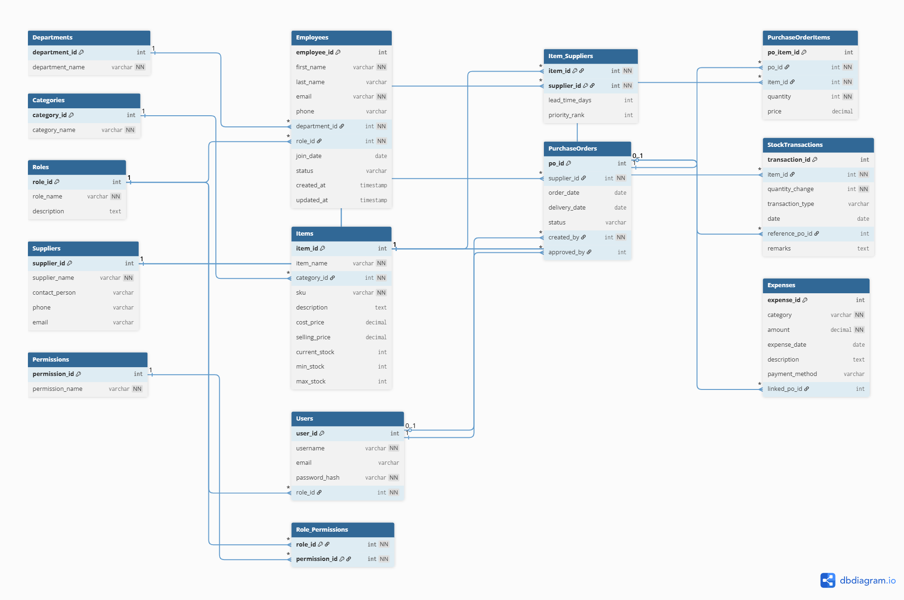

# ERD v0.1 — ERP Mini System

This document describes the first version of the Entity Relationship Diagram (ERD) designed for the ERP system. It includes all major modules and relationships.

---

## 1. ERD Diagram (v0.1)

**Includes:**

- HR (Employees, Departments, Roles)
- Inventory (Items, Categories, Suppliers)
- Purchase Orders (PO & PO Items)
- Stock Control (StockTransactions)
- Finance (Expenses)
- RBAC (Users, Role_Permissions)

Refer to the attached ERD image.

---

## 2. Primary Relationships Overview

### HR Module

- Departments (1) → Employees (many)
- Roles (1) → Employees (many)

### Inventory Module

- Categories (1) → Items (many)
- Items (many) ↔ Suppliers (many) via Item_Suppliers

### Purchase Orders

- Suppliers (1) → PurchaseOrders (many)
- PurchaseOrders (1) → PurchaseOrderItems (many)
- Items (1) → PurchaseOrderItems (many)

### Stock Control

- Items (1) → StockTransactions (many)
- PurchaseOrders (1) → StockTransactions (many, optional)

### Finance

- PurchaseOrders (1) → Expenses (many, optional)

### RBAC

- Roles (1) → Users (many)
- Users (1) → PurchaseOrders (created_by, approved_by)

---

## 3. Notes for Improvement

As per review:

- Add NOT NULL constraints to key fields
- Add default values (timestamps, stock number defaults)
- Add CHECK constraints for status and transaction types
- Add CASCADE/RESTRICT rules based on workflow
